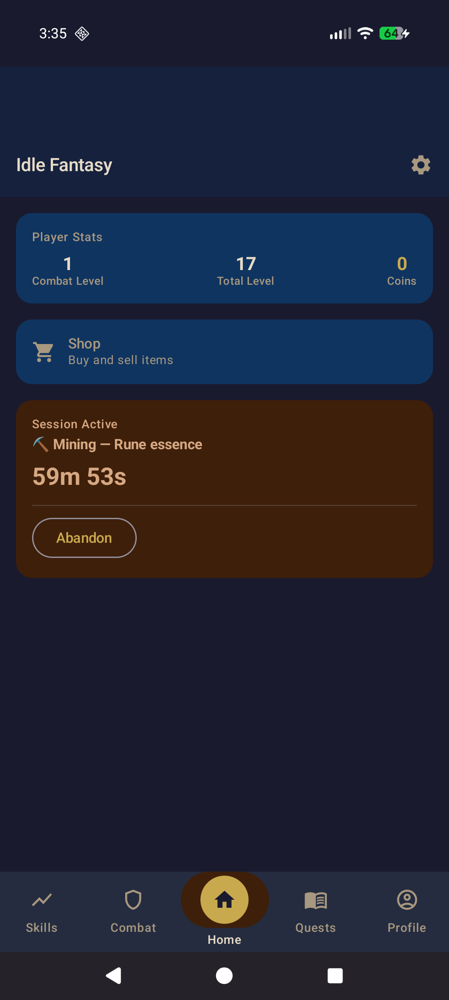
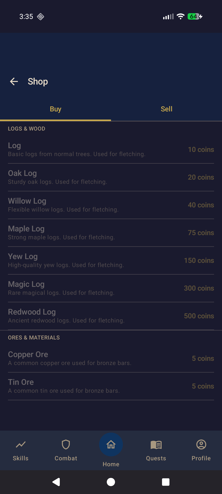
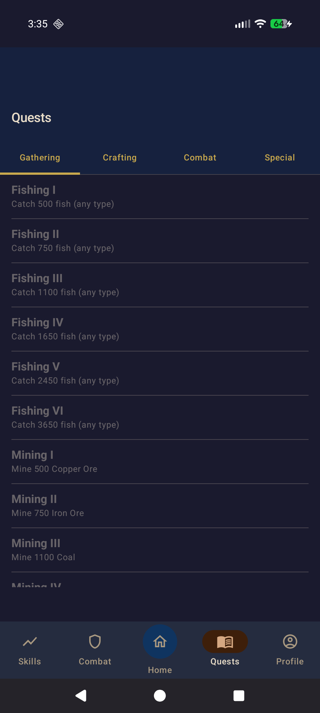

# Idle Fantasy

**Set your hero to work. Close the app. Come back to loot.**

A free, open-source offline idle RPG for Android. No internet connection, no account, no ads.

<p align="center">
  
  
  
  
</p>

## How it works

Please see the [dedicated wiki](https://idlefantasy.tristinbaker.xyz/) for more detailed information.

Pick a skill or dungeon, start a session, then put your phone down. Your hero keeps training for up to an hour while the app is closed. Come back whenever you want to collect your XP and loot, then send them back out. There is no stamina bar, no energy system, and nothing that pressures you to stay in the app.

## Skills

Train **23 skills** at your own pace:

- **Gathering** (7): Mining, Fishing, Woodcutting, Farming, Firemaking, Agility, Thieving
- **Crafting** (7): Smithing, Cooking, Fletching, Crafting, Runecrafting, Herblore, Construction
- **Combat** (7): Attack, Strength, Defense, Ranged, Magic, Hitpoints, Prayer
- **Support** (2): Mercantile, Slayer

Better equipment means faster gathering and surviving tougher dungeons. Craft your own gear or buy it from the Shop. Crafting windows display required ingredients alongside your currently owned item count (`Owned: X`). The **Mercantile** skill levels through trade routes and unlocks better prices. **Slayer** tasks are assigned by the Slayer Master in town and are completed by fighting specific enemies in dungeons.


## Combat and dungeons

Explore **20 dungeons** from the starter Farm all the way to late-game Fortress Ruins and beyond. Each dungeon has its own enemy roster, difficulty rating, and potential drops. Before you go in, the game tells you how your current gear stacks up. Choose from Melee, Ranged, or Magic; each style levels its own combat skills.

## Infinite Tower

Climb an endless combat gauntlet, one floor at a time. Enemies grow tougher the higher you go, and every 10 floors unlocks a milestone reward, from unique gear to permanent XP and coin bonuses.

## Expeditions

Explore non-combat skilling dungeons to uncover lore notes. Finding enough notes in an area unlocks new combat dungeons to challenge.

## Quests

Over **170 quests** span all skills. Daily quests reset every morning for a quick goal to aim at. Long-term quests track cumulative progress over many sessions. Completing quests earns XP, coins, and item rewards.

## Guild System

**17 guilds** cover every skill and combat style (Warriors, Archers, and Mages guilds for combat). Each guild has up to 10 rank levels. Advance by completing progression quests and earning reputation through daily requests. Higher ranks unlock harder dailies and better cross-skill rewards, letting specialists access resources from skills they don't personally train.

## Builder's Workshop

Spend Construction materials to upgrade the Inn, Guild Hall, and Church, unlocking better worker slots, guild perks, and stronger blessings.

## Church

The **Church** offers timed blessings powered by Prayer levels and bones. Blessings come in three types (XP boosts up to 1.5×, Defense bonuses, and Coin multipliers), with stronger tiers unlocking at higher Prayer levels. One blessing can be active at a time and its status and remaining duration are shown on the home screen.

## Slayer

Visit the **Slayer Master** in town to receive a task: kill a set number of a specific enemy type in the dungeons. Each kill earns Slayer XP on top of regular combat XP. Complete tasks to level the Slayer skill and unlock assignments against tougher creatures.

## Pets and the Inn

Rare enemies drop **collectible pets** that grant permanent passive XP bonuses. The **Inn** lets you hire workers who can queue up sessions on your behalf, and buy food in bulk to keep your fighter alive longer in tougher dungeons.

## Carnival

Visit the traveling Carnival to play idle minigames, the Archery Range, Strongman Competition, Wizard's Duel, and Fishing Derby, that convert your skill levels into tickets over time, plus active minigames like Ring Toss. Spend tickets in the Carnival Shop on exclusive equipment, pets, and XP lamps.

## Getting the app

[Download F-Droid](https://f-droid.org/), and set up the official [Idle Fantasy Repository](https://github.com/tristinbaker/IdleFantasy/discussions/516)

Or grab the latest APK from the [Releases page](https://github.com/tristinbaker/IdleFantasy/releases).

## Translating

The game is available in English, German, French, Spanish, and Turkish. Translations live in standard Android string resource files and are Weblate-compatible. See [TRANSLATING.md](TRANSLATING.md) to add a new language or improve an existing one.

## Contributing

Bug reports and pull requests are welcome. Open an issue before starting large changes so the approach can be discussed first.

See the [contributors graph](https://github.com/tristinbaker/IdleFantasy/graphs/contributors) for a full list of contributors.

---

## For developers

**Language:** Kotlin  
**UI:** Jetpack Compose + Material 3  
**Database:** Room (SQLite)  
**Background work:** WorkManager  
**JSON parsing:** kotlinx.serialization  
**Architecture:** MVVM + Repository  
**Dependency injection:** Hilt  
**Notifications:** NotificationCompat  
**Localization:** Android string resources (Weblate-compatible)  

No Google Play Services dependency. F-Droid compatible.

### Building from source

Requirements: Android Studio Hedgehog or newer, JDK 17+, Android SDK 34

```bash
git clone https://github.com/tristinbaker/IdleFantasy.git
cd IdleFantasy
./gradlew :app:assembleDebug
```

The debug APK will be at `app/build/outputs/apk/debug/app-debug.apk`.

## License

GPL-3.0. See [LICENSE](LICENSE) for details.
